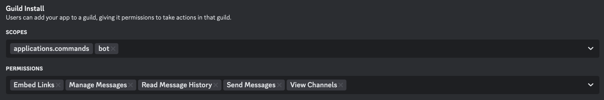

# Baldur's Gate 3 Discord Lobby Bot

A quick Discord bot I wrote for my friends and I, who recently started playing Baldur's Gate 3 together.


# Features

- Reads a user's activity to see if they create a BG3 multiplayer lobby
- Pings them to remind them to set the connection code
- Automatically sends and updates a permanent message in a specified channel with the current code, party information (slots filled/capacity), and the last updated time
- Slash commands for the host to get/clear the lobby code
- Slash command for players to get the current code, along with all of the other usual info
- Slash commands for subscribing/unsubscribing to DMs that are sent out when the code changes

# Requirements

- Python 3+ (only tested on 3.13.2)
- An... Internet connection? :P

# Usage

You can host this bot yourself! Just create a new app ***and bot*** on the Discord developer console, and make sure to give the app the `applications.commands` and `bot` scopes on the __**Installation**__ tab of the settings, with the following permissions:

- View Channels
- Send Messages
- Manage Messages
- Read Message History
- Embed Links



You may need to tweak these when you join the bot, as your server may have funky permissions that may be needed to access and send messages in the proper channel. Make sure you invite the app/bot to the target server! :)

Then, clone this repo, and inside the repo's folder, create a .env file and specify:
- `DISCORD_TOKEN` -- the Discord API token provided when you make the bot
- `USER_ID` -- the Discord ID of the host
- `CHANNEL_ID` -- the channel ***ID*** where you want the bot to keep the permanent info message

Install the requirements:
```sh
python3 -m pip install -r requirements.txt
```

Run time :D
```sh
python3 bg3_lobby_bot.py
```

Note that if you mess anything up, there's pretty copious amounts of logging built into the bot, so just check your CLI to see why the bot can't do what you expect. GLHF!